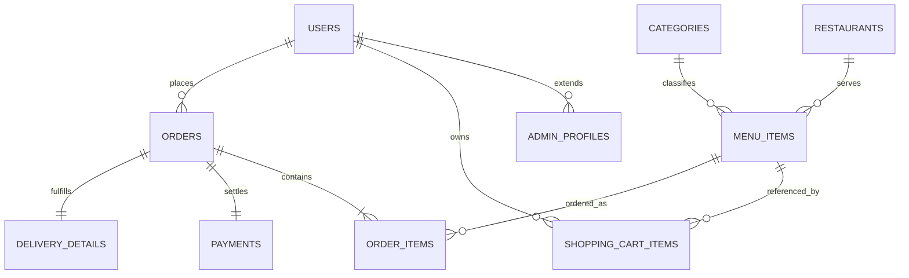

# Entity–Relationship Overview (Campus Eateries)

The physical schema ships as `sql/01_schema.sql`. The diagram below is a concise Mermaid ER view suitable for coursework appendices.

### Cardinality notes

- `users (1) → (0..1) admin_profiles`: only `ADMIN` role rows materialize child tuples.
- `restaurants (1) → (*) menu_items`, `categories (1) → (*) menu_items`.
- `users (1) → (*) shopping_cart_items` with composite uniqueness on `(user_id, menu_item_id)`.
- `orders (1) → (*) order_items` captures price snapshots (`snapshot_unit_price`, `line_total`).
- `orders (1) → (1) payments` enforced by unique index on `payments.order_id`.
- `orders (1) → (1) delivery_details` likewise unique on `delivery_details.order_id`.

### Many-to-many resolution

Conceptually **users ⇄ menu items** interact through the **cart** (`shopping_cart_items`) and persisted **orders** (`order_items`), both associative tables with descriptive attributes (`quantity`, `snapshot_unit_price`, etc.), which keeps the model in third normal form.
